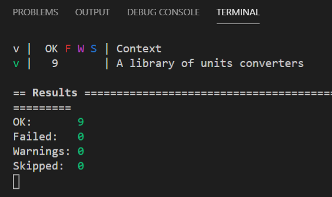

# Units Converters Created Following TDD with `testthat`

It's really important early on in your coding career to instill GOOD habits like writing unit tests. TDD, or test-driven development, is the process of starting by writing a failing test, then writing just enough code to make it pass, then refactoring it until it is correct, well-tested, and well-formatted before going on to the next part of your program.

This is a small library of units conversion functions designed to be useful to a physicist, engineer, chemist, or other scientist. The process of writing this code exposed the importance of being cognizant of significant digits and the dangers of rounding off too early or using approximations that are too rough.

Here is a screenshot of the tests running successfully:

To run these tests:

1. clone this repo
2. from the terminal, run the tests using `./rtest`

This assumes that R is installed on your system and `Rscript` is available on your `$PATH`.
